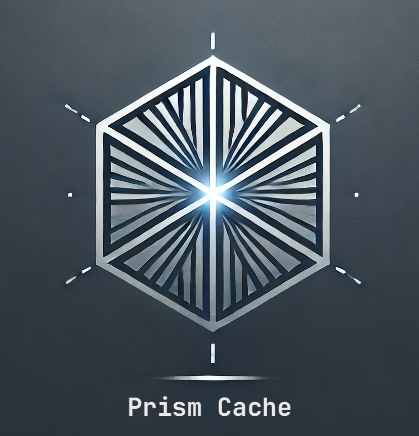
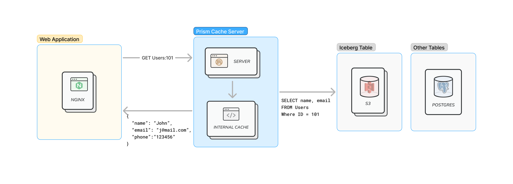

<div align="center">

</div>

# Prism Cache

A Redis-protocol compatible caching layer for databases and big data tables, bridging the gap between the durability of blob storage  and high-performance caching.

<div align="center">

</div>

## Overview

Prism Cache provides a Redis-compatible interface to your existing databases, offering:

- **Redis Protocol Support**: Interact with your database using familiar Redis commands
- **Transparent Caching**: Automatic caching of database queries with configurable TTL
- **Database Flexibility**: Support for various database backends (SQL, In-Memory, etc.)
- **Performance**: Reduce database load by caching frequently accessed data
- **Consistency**: Configurable cache invalidation strategies

## How It Works

Prism Cache sits between your application and database:

```
Application <-> Prism Cache <-> Database
     ↓              ↓
Redis Protocol   Cache Layer
```

1. **Redis Protocol Interface**: 
   - Applications connect using standard Redis clients
   - Supports common Redis commands mapped to database operations
   - No application changes needed if you're already using Redis

2. **Intelligent Caching**:
   - First access fetches data from the database and populates the cache
   - Subsequent reads are served from cache until TTL expires
   - Configurable cache size and eviction policies
   - Write-through caching ensures consistency

3. **Database Adapters**:
   - Translates Redis operations to database queries
   - Supports multiple database backends
   - Easy to add new database adapters

## Benefits

1. **Simplified Architecture**:
   - Use Redis protocol for any database
   - No need for separate Redis deployment
   - Single system for both caching and storage

2. **Performance**:
   - Reduce database load
   - Fast in-memory access for hot data
   - Automatic cache management

3. **Consistency**:
   - Write-through caching
   - Configurable TTL
   - Atomic operations support

4. **Cost Effective**:
   - Eliminate need for separate Redis servers
   - Reduce database load and associated costs
   - Scale cache independently of storage

## Caching Strategy

Prism Cache employs a smart caching strategy:

```rust
pub async fn fetch_fields(&self, entity: &str, id: &str, fields: &[&str]) -> StorageResult<EntityData> {
    // Try cache first
    match self.cache.get_fields(entity, id, fields).await {
        Ok(data) if !data.is_empty() => {
            // Cache hit
            Ok(data)
        }
        _ => {
            // Cache miss - fetch from database
            let data = self.db.fetch_fields(entity, id, fields).await?;
            
            // Populate cache
            if !data.is_empty() {
                self.cache.set_fields(entity, id, &data).await?;
            }
            
            Ok(data)
        }
    }
}
```

- **Cache-Aside Pattern**: Check cache before hitting database
- **Automatic Population**: Cache misses populate the cache
- **Configurable TTL**: Control how long data stays in cache
- **Write-Through**: Updates go to both cache and database
- **Bulk Operations**: Efficient handling of multi-key operations

## Project Structure

```
src/
├── config/         # Configuration handling
├── storage/        # Core storage implementation
│   ├── cache/      # Cache implementation
│   └── database/   # Database adapters
│       ├── mod.rs      # Database type definitions
│       ├── in_memory.rs # In-memory database adapter
│       └── sql.rs      # SQL database adapter
└── main.rs         # Application entry point
```

## Adding a New Database Adapter

To add a new database adapter (e.g., Redis), follow these steps:

1. **Add the Provider Type**

In `src/config.rs`, add a new variant to the `DatabaseProvider` enum:

```rust
pub enum DatabaseProvider {
    InMemory,
    Sql,
    Redis,  // New variant
}
```

2. **Create the Adapter Implementation**

Create a new file `src/storage/database/redis.rs`:

```rust
use async_trait::async_trait;
use crate::storage::{DatabaseAdapter, EntityData, StorageError, StorageResult};

#[derive(Debug)]
pub struct RedisAdapter {
    connection_string: String,
}

impl RedisAdapter {
    pub fn new(connection_string: &str) -> Self {
        Self {
            connection_string: connection_string.to_string(),
        }
    }
}

#[async_trait]
impl DatabaseAdapter for RedisAdapter {
    async fn fetch_fields(
        &self,
        entity: &str,
        id: &str,
        fields: &[&str],
    ) -> StorageResult<EntityData> {
        // Implement Redis-specific logic here
    }
}
```

3. **Update the Database Type**

In `src/storage/database/mod.rs`, add the new adapter:

```rust
pub mod redis;
pub use redis::RedisAdapter;

#[derive(Debug)]
pub enum DatabaseType {
    InMemory(InMemoryAdapter),
    Sql(SqlAdapter),
    Redis(RedisAdapter),  // New variant
}

#[async_trait]
impl DatabaseAdapter for DatabaseType {
    async fn fetch_fields(&self, entity: &str, id: &str, fields: &[&str]) 
        -> StorageResult<EntityData> 
    {
        match self {
            DatabaseType::InMemory(adapter) => adapter.fetch_fields(entity, id, fields).await,
            DatabaseType::Sql(adapter) => adapter.fetch_fields(entity, id, fields).await,
            DatabaseType::Redis(adapter) => adapter.fetch_fields(entity, id, fields).await,
        }
    }
}
```

4. **Update the Factory Function**

In `src/storage/database/mod.rs`, update the `create_database` function:

```rust
pub fn create_database(
    provider: &DatabaseProvider,
    connection_string: Option<&str>,
) -> DatabaseType {
    match provider {
        DatabaseProvider::InMemory => DatabaseType::InMemory(InMemoryAdapter::new()),
        DatabaseProvider::Sql => {
            let conn_string = connection_string.unwrap_or("default_connection");
            DatabaseType::Sql(SqlAdapter::new(conn_string))
        },
        DatabaseProvider::Redis => {
            let conn_string = connection_string.unwrap_or("redis://localhost:6379");
            DatabaseType::Redis(RedisAdapter::new(conn_string))
        },
    }
}
```

## Configuration

Configure via `config/default.yaml`:

```yaml
database:
  provider: mock  # Available providers: mock, sql
  connection_string: "postgres://localhost/mydb"  # Only needed for sql provider

cache:
  max_entries: 10000  # Maximum number of cached entries
  ttl_seconds: 3600   # Cache TTL in seconds
```

Or via environment variables:

```bash
PRISM_CACHE__DATABASE__PROVIDER=mock  # Available: mock, sql
PRISM_CACHE__DATABASE__CONNECTION_STRING=postgres://localhost/mydb
PRISM_CACHE__CACHE__MAX_ENTRIES=10000
PRISM_CACHE__CACHE__TTL_SECONDS=3600
```

## Usage

Connect using any Redis client:

```python
import redis

# Connect to Prism Cache
r = redis.Redis(host='localhost', port=6379)

# Use regular Redis commands - they'll be cached automatically
r.get('users:1:name')  # Fetches from database, caches result
r.get('users:1:name')  # Serves from cache
```

## Testing

Each adapter should implement its own tests. For example:

```rust
#[cfg(test)]
mod tests {
    use super::*;

    #[tokio::test]
    async fn test_redis_fetch_fields() {
        let adapter = RedisAdapter::new("redis://localhost:6379");
        let result = adapter.fetch_fields("users", "user1", &["name"]).await;
        assert!(result.is_ok());
    }
}
```

## Contributing

When adding a new database adapter:

1. Create a new branch: `git checkout -b feature/redis-adapter`
2. Follow the steps above to implement the adapter
3. Add comprehensive tests
4. Update documentation
5. Submit a pull request 

## Multi-Provider Feature Testing

This branch (`feature/multi-provider`) implements support for multiple data providers, allowing you to access different data sources through a unified Redis-compatible interface.

### How to Test

1. **Clone the repository and checkout the branch:**
   ```bash
   git clone https://github.com/a-agmon/prism_cache.git
   cd prism_cache
   git checkout feature/multi-provider
   ```

2. **Build the project:**
   ```bash
   cargo build
   ```

3. **Configure your data providers:**
   
   Create a `config.toml` file in the project root (or use the provided sample):
   ```toml
   # Prism Cache Configuration

   [database]
   # List of data providers
   [[database.providers]]
   name = "users"
   provider = "Mock"
   settings = { sample_size = "10" }

   [[database.providers]]
   name = "products"
   provider = "Mock"
   settings = { sample_size = "5" }

   [cache]
   max_entries = 10000
   ttl_seconds = 300

   [server]
   bind_address = "127.0.0.1:6379"

   [logging]
   level = "debug"
   ```

4. **Run the server:**
   ```bash
   cargo run
   ```

5. **Test with Redis CLI:**
   
   In a new terminal, use Redis CLI to test the different providers:
   ```bash
   # Get a user record
   redis-cli GET users:123
   
   # Get a product record
   redis-cli GET products:789
   
   # Get a specific field from a user record
   redis-cli HGET users:123 name
   ```

### What's New

- **Multiple Data Providers**: Configure and use multiple data sources simultaneously
- **Provider-Based Access**: Use the format `provider:id` to access records from specific providers
- **Improved Error Handling**: Better error messages for provider not found cases
- **Sample Configuration**: Includes a sample configuration with multiple providers

### Feedback

Please test the feature and provide feedback on:
1. Configuration usability
2. Command syntax and behavior
3. Error handling
4. Performance with multiple providers

Report any issues or suggestions by creating a GitHub issue or contacting the development team.

## License

MIT 
