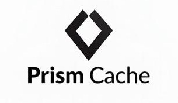

<div align="center">

     <h3><strong>A caching layer for big data tables (Iceberg, Delta, etc) and databases with Redis compatible API, bridging the gap between data durability and high-performance caching</strong></h3>
</div>
<br/>

## Overview

Prism Cache provides a Redis-compatible API to your existing databases and big data tables, offering:

- **Redis Protocol Support**: Interact with your database using familiar Redis commands (GET and HGET)
- **JSON Record Retrieval**: Automatically retrieves records in JSON format
- **Transparent Caching**: Automatic caching of database queries with configurable TTL
- **Database Flexibility**: Support for various data backends
- **Simple**: Eliminates the need for separate ETL infrastructure by directly caching big data tables

## How It Works

Prism Cache sits between your application and database:

<div align="center">

</div>

1. **Redis Protocol Interface**: 
   - Applications connect using standard Redis clients
   - Supports GET and HGET Redis commands mapped to retrieval operations
   - No application changes needed if you're already using Redis

2. **Intelligent Caching**:
   - First access fetches data from the database and populates the cache
   - Subsequent reads are served from cache until TTL expires
   - Configurable cache size and eviction policies
   - Write-through caching ensures consistency

3. **Database Adapters**:
   - Translates Redis operations to database queries
   - Supports multiple database backends
   - Easy to add new database adapters

## Benefits

1. **Simplified Architecture**:
   - Use Redis protocol for any database
   - No need for separate Redis deployment
   - Single system for both caching and storage

2. **Performance**:
   - Reduce database load
   - Fast in-memory access for hot data
   - Automatic cache management

3. **Consistency**:
   - Write-through caching
   - Configurable TTL
   - Atomic operations support

4. **Cost Effective**:
   - Eliminate need for separate Redis servers
   - Reduce database load and associated costs
   - Scale cache independently of storage

## Usage

Connect using any Redis client:

```python
import redis

# Connect to Prism Cache
r = redis.Redis(host='localhost', port=6379)

# Use regular Redis commands - they'll be cached automatically
r.get('users:101')  # Fetches from database, caches result
r.get('users:101')  # Serves from cache

```

In a new terminal, use Redis CLI to test the different providers:
```bash
# Get a user record
redis-cli GET users:123

# Get a product record
redis-cli GET products:789

# Get a specific field from a user record
redis-cli HGET users:123 name
```


## Configuration
   
   Create a `config.toml` file in the project root (or use the provided sample):
   ```toml
   # Prism Cache Configuration

   [database]
   # List of data providers
   [[database.providers]]
   name = "users"
   provider = "Mock"
   settings = { sample_size = "10" }

   [[database.providers]]
   name = "products"
   provider = "Mock"
   settings = { sample_size = "5" }

   [cache]
   max_entries = 10000
   ttl_seconds = 300

   [server]
   bind_address = "127.0.0.1:6379"

   [logging]
   level = "debug"
   ```

## License

Attached 
